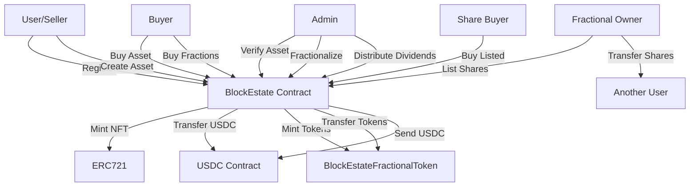

# BlockEstate - Decentralized Real Estate Platform

A decentralized application (DApp) for real estate asset management, enabling non-custodial listing, fractional ownership, secondary market trading, and automated dividend distribution on the Celo Blockchain using USDC as the payment token. Built with Solidity ^0.8.28, Hardhat, and OpenZeppelin, the platform supports secure, transparent real estate transactions with features like multi-admin verification, seller registration, comprehensive portfolio tracking, peer-to-peer share trading, and automated dividend distribution.

[](https://docs.soliditylang.org/)
[](https://openzeppelin.com/contracts/)
[](https://hardhat.org/)
[](https://celo.org/)
[](LICENSE)

## Table of Contents
- [Project Overview](#project-overview)
- [Features](#features)
- [Architecture](#architecture)
- [Smart Contracts](#smart-contracts)
- [Prerequisites](#prerequisites)
- [Installation](#installation)
- [Configuration](#configuration)
- [Testing](#testing)
- [Deployment](#deployment)
- [Usage Examples](#usage-examples)
- [Security](#security)
- [Gas Optimization](#gas-optimization)
- [Contributing](#contributing)
- [License](#license)
- [Contact](#contact)

## Project Overview

BlockEstate is a comprehensive decentralized platform designed to revolutionize real estate investment by enabling:

- **Property Tokenization**: Convert real estate assets into NFTs (ERC-721) with detailed metadata
- **Fractional Ownership**: Split properties into ERC-20 tokens for accessible investment
- **Secondary Market Trading**: Peer-to-peer marketplace for buying and selling fractional shares
- **Direct Share Transfers**: Off-platform transfer of shares between users
- **Secure Transactions**: All payments handled in USDC stablecoin for price stability
- **Multi-Admin System**: Distributed verification and management authority
- **Dividend Distribution**: Automated proportional payouts to fractional investors
- **Complete Transparency**: All transactions and ownership tracked on-chain
- **Celo Integration**: Leveraging Celo's mobile-first, carbon-negative blockchain

### Key Goals

1. **Democratize Real Estate Investment**: Lower barriers to entry through fractional ownership
2. **Enable Liquidity**: Secondary market for trading fractional shares
3. **Ensure Security**: Leverage OpenZeppelin's battle-tested contracts and ReentrancyGuard
4. **Maintain Transparency**: All transactions publicly verifiable on blockchain
5. **Non-Custodial Architecture**: Sellers retain control until sale completion
6. **Scalable Design**: Support for unlimited assets and fractional investors
7. **Mobile Accessibility**: Built on Celo for seamless mobile experience

### Platform Economics

- **Listing Fee**: 3% charged on successful full asset sales (paid to platform)
- **Cancellation Penalty**: 1% charged on buyer cancellations (paid to platform)
- **Share Trading Fee**: 2% charged on secondary market share trades (paid to platform)
- **Fractional Initial Purchases**: Zero fees on primary fractional purchases (sellers receive full payment)
- **Dividend Distribution**: No platform fees (100% distributed to token holders)
- **Direct Transfers**: Zero fees on peer-to-peer transfers outside marketplace

## Features

### Core Features

#### 🏠 Asset Management
- **Asset Creation**: Registered sellers mint NFTs representing real estate properties
- **Metadata Storage**: IPFS integration for decentralized asset information
- **Multi-Admin Verification**: Distributed authority for asset approval
- **Asset Delisting**: Admins can remove problematic listings with automatic refunds
- **Status Tracking**: Real-time monitoring of asset lifecycle (created → verified → sold)
- **Withdrawal Control**: Admin-controlled withdrawal permissions for fractional buyers

#### 👥 User Management
- **Seller Registration**: One-time registration required to list properties
- **Multi-Admin System**: Owner can add/remove multiple admins
- **Seller Metrics**: Track confirmed and canceled purchase counts
- **Portfolio Views**: Comprehensive dashboards for buyers and sellers
- **Fractional Ownership Tracking**: View all investments with ownership percentages

#### 💰 Transaction Handling
- **Full Asset Purchase**: Buy entire property ownership
- **Two-Step Purchase Flow**: Payment lock → buyer confirmation → ownership transfer
- **Cancellation Mechanism**: Buyers can cancel with 1% penalty
- **USDC Payments**: All transactions in USDC stablecoin
- **Automatic Fee Distribution**: Platform fees auto-sent to owner
- **Escrow Protection**: Secure holding of funds during transactions

#### 🔀 Fractional Ownership
- **Asset Fractionalization**: Admins split assets into ERC-20 tokens
- **Partial Purchases**: Buy any amount of available tokens
- **Dynamic Pricing**: Price per token = total price / token count
- **Ownership Tracking**: Precise percentage calculations for all investors
- **Controlled Cancellation**: Fractional buyers can exit when admin enables withdrawal
- **Full Ownership Conversion**: Single buyer acquiring all tokens receives NFT
- **Buyer Portfolio**: Track all fractional investments with percentages and values

#### 🛒 Secondary Market Trading
- **List Shares for Sale**: Fractional owners can list their shares on the platform marketplace
- **Buy Listed Shares**: Purchase shares from other investors at listed prices
- **Escrow Protection**: Shares held in contract during listing period
- **Cancel Listings**: Sellers can cancel active listings and retrieve shares
- **Platform Fee**: 2% fee on successful trades (split: seller receives 98%, platform 2%)
- **Market Discovery**: View all active listings across all assets
- **Asset-Specific Listings**: Filter listings by specific properties

#### 📤 Direct Share Transfers
- **Peer-to-Peer Transfers**: Transfer shares directly to any address
- **Zero Fees**: No platform fees for direct transfers
- **Automatic Tracking**: Recipient automatically added to buyer list
- **Ownership Updates**: Instant balance updates for both parties
- **Off-Platform Sales**: Enable private transactions outside the marketplace

#### 💸 Dividend System
- **Proportional Distribution**: USDC dividends split by ownership percentage
- **Batch Payments**: Single transaction distributes to all fractional owners
- **Automated Calculations**: Contract handles all proportional math
- **Admin Control**: Only admins can trigger distributions
- **Precise Allocation**: Handles remainder distribution automatically

#### 📊 Advanced Queries
- **Asset Display Info**: Complete asset details including fractional data
- **Available Assets**: Filter for verified, unsold properties
- **Fractionalized Assets**: List all assets with partial ownership
- **Buyer Portfolio**: Track all fractional investments with percentages and values
- **Seller Dashboard**: View all owned assets with status
- **Fractional Buyer Lists**: See all investors in a property with their stakes
- **Share Listings**: View all active share listings (by asset or platform-wide)
- **Seller Metrics**: Query confirmed and canceled purchase counts

### Security Features

- ✅ **ReentrancyGuard**: Protection on all financial functions
- ✅ **Access Control**: Owner and multi-admin role management
- ✅ **Custom Errors**: Gas-efficient error handling
- ✅ **Input Validation**: Comprehensive parameter checks
- ✅ **Safe Transfers**: OpenZeppelin's secure token transfer methods
- ✅ **Approval Checks**: Verify NFT and token approvals before operations
- ✅ **State Validation**: Prevent invalid state transitions
- ✅ **Escrow Protection**: Secure holding of assets during listings
- ✅ **Address Validation**: Prevent transfers to zero address or self
- ✅ **Balance Verification**: Check sufficient balances before operations

### Event System

All critical actions emit events for transparency and UI updates:

**Asset Events:**
- `AssetCreated`, `AssetVerified`, `AssetDelisted`
- `AssetPurchased`, `AssetPaymentConfirmed`, `AssetCanceled`

**Fractional Events:**
- `FractionalAssetCreated`, `FractionalAssetPurchased`
- `FractionalDividendsDistributed`

**Share Trading Events:**
- `SharesTransferred`: Direct peer-to-peer transfers
- `SharesListed`: New share listing created
- `SharesPurchased`: Successful marketplace purchase
- `ShareListingCanceled`: Listing canceled by seller

**Administrative Events:**
- `SellerRegistered`, `USDCWithdrawn`

## Architecture

### System Design

```
┌─────────────────────────────────────────────────────────┐
│                    BlockEstate                           │
│  ┌──────────────┐  ┌──────────────┐  ┌──────────────┐  │
│  │   ERC721     │  │ ERC721Holder │  │ ReentrancyG  │  │
│  │ URIStorage   │  │              │  │    uard      │  │
│  └──────────────┘  └──────────────┘  └──────────────┘  │
│  ┌──────────────┐                                       │
│  │   Ownable    │                                       │
│  └──────────────┘                                       │
└─────────────────────────────────────────────────────────┘
           │                    │                    │
           ▼                    ▼                    ▼
  ┌─────────────────┐  ┌─────────────────┐  ┌─────────────────┐
  │BlockEstateFrac- │  │   USDC Token    │  │  Asset Metadata │
  │tionalToken      │  │    (ERC-20)     │  │  (IPFS/HTTP)    │
  │    (ERC-20)     │  │                 │  │                 │
  └─────────────────┘  └─────────────────┘  └─────────────────┘
```

### Data Flow

#### Asset Listing Flow
```
Seller → registerSeller() → createAsset() → [Pending]
                                                 ↓
                                     Admin → verifyAsset()
                                                 ↓
                                           [Available]
                                           ↙         ↘
                                    buyAsset()  createFractionalAsset()
```

#### Full Purchase Flow
```
Buyer → buyAsset() → [USDC Locked]
           ↓
    confirmAssetPayment() → [NFT Transfer + Payment Distribution]
           OR
    cancelAssetPurchase() → [Refund - 1% Penalty]
```

#### Fractional Purchase Flow
```
Admin → createFractionalAsset() → [ERC-20 Tokens Minted]
                                          ↓
Multiple Buyers → buyFractionalAsset() → [Tokens Distributed]
                                          ↓
                                   [Secondary Market]
                                          ↓
                    ┌─────────────────────┴─────────────────────┐
                    ↓                                           ↓
         listSharesForSale()                         transferShares()
         (Platform Marketplace)                    (Direct Transfer)
                    ↓                                           
         buyListedShares()                                      
         (2% Platform Fee)                                      
                    ↓
Admin → distributeFractionalDividends() → [USDC to All Owners]
```

#### Share Trading Flow
```
Fractional Owner
       ↓
   ┌───┴────┐
   ↓        ↓
Direct    List on
Transfer  Marketplace
   ↓        ↓
transferShares()  listSharesForSale()
   ↓                     ↓
No Fee          [Escrow: Shares in Contract]
   ↓                     ↓
Instant          buyListedShares()
Transfer              ↓
              [2% Fee to Platform]
                      ↓
              [98% to Seller]
                      ↓
              [Shares to Buyer]
```

### Contract Interactions



## Smart Contracts

### BlockEstate.sol (Main Contract)

**Main contract** handling all platform logic.

- **Contract Name**: BlockEstate
- **Token Symbol**: BET (BlockEstateAssetToken)
- **Inherits**: Ownable, ERC721URIStorage, ERC721Holder, ReentrancyGuard
- **Functions**: 40+ public/external functions
- **Events**: 13 distinct event types
- **Errors**: 25+ custom errors

**Key Constants:**
```solidity
LISTING_FEE_PERCENTAGE = 3              // 3% on full asset sales
CANCELLATION_PENALTY_PERCENTAGE = 1     // 1% on cancellations
SHARE_TRADING_FEE_PERCENTAGE = 2        // 2% on secondary market trades
PERCENTAGE_DENOMINATOR = 100
PERCENTAGE_SCALE = 1e18                 // Precision for percentages
START_TOKEN_ID = 1
```

**Key State Variables:**
```solidity
BlockEstateFractionalToken public immutable realEstateToken;
IERC20 public immutable usdcToken;
mapping(uint256 => RealEstateAsset) public realEstateAssets;
mapping(uint256 => FractionalAsset) public fractionalAssets;
mapping(uint256 => ShareListing) public shareListings;
mapping(address => bool) public sellers;
mapping(address => bool) public isAdmin;
mapping(uint256 => bool) public buyerCanWithdraw;
```

### BlockEstateFractionalToken.sol

**ERC-20 token** for fractional ownership.

- **Token Name**: BlockEstateFractionalToken
- **Token Symbol**: BFT
- **Standard**: ERC-20 (OpenZeppelin)
- **Minting**: Only BlockEstate contract can mint
- **Transferable**: Standard ERC-20 transfers enabled for secondary market
- **Burning**: Not supported (prevent supply manipulation)
- **Decimals**: 18 (standard ERC-20)

### MockUSDC.sol (Testing Only)

**Mock USDC** for local development.

- **Standard**: ERC-20
- **Decimals**: 6 (matches real USDC)
- **Faucet**: Public mint function for testing

## Prerequisites

### Required Software

- **Node.js**: v20.0.0 or higher
- **npm**: v8.x or higher
- **Git**: Latest stable version
- **Ethereum Wallet**: MetaMask, Valora, or Celo Wallet

### Development Tools

- **Hardhat**: v2.24.0
- **Solidity**: ^0.8.28
- **OpenZeppelin Contracts**: v4.9.0
- **Hardhat Toolbox**: v5.0.0

### Recommended IDE Setup

- **VS Code** with extensions:
  - Solidity by Juan Blanco
  - Hardhat Solidity
  - ESLint
  - Prettier

## Installation

### 1. Clone Repository

```bash
git clone https://github.com/rocknwa/BlockEstate.git
cd BlockEstate
```

### 2. Install Dependencies

```bash
npm install
```

This installs:
- Hardhat and plugins
- OpenZeppelin contracts

### 3. Verify Installation

```bash
npx hardhat --version
```

### 4. Compile Contracts

```bash
npx hardhat compile
```


## Configuration

### Environment Setup

Create a `.env` file in the root directory:

```env
# Private key for deployment (DO NOT COMMIT)
PRIVATE_KEY=your_private_key_here

# Block explorer API key for verification
ETHERSCAN_API_KEY=your_celoscan_api_key
```

## Testing

### Run All Tests

```bash
npx hardhat test
```

### Run Specific Test File

```bash
npx hardhat test test/BlockEstate.test.js
```

### Run with Gas Reporting

```bash
REPORT_GAS=true npx hardhat test
```

### Generate Coverage Report

```bash
npx hardhat coverage
```

### Key Test Coverage

- ✅ Seller registration and validation
- ✅ Asset creation and metadata
- ✅ Admin verification workflows
- ✅ Full asset purchase flow
- ✅ Purchase cancellation with penalties
- ✅ Fractional asset creation
- ✅ Fractional token purchases
- ✅ Controlled fractional cancellations
- ✅ Share listing creation and management
- ✅ Marketplace share purchases with fees
- ✅ Direct share transfers
- ✅ Listing cancellations
- ✅ Dividend distribution calculations
- ✅ Asset delisting scenarios
- ✅ Access control enforcement
- ✅ Error handling and edge cases
- ✅ Gas optimization
- ✅ Reentrancy protection
- ✅ Escrow functionality

## Deployment

### 1. Local Deployment (Hardhat Network)

```bash
# Terminal 1: Start local node
npx hardhat node

# Terminal 2: Deploy contracts
npx hardhat run scripts/deploy.js --network localhost
```
  

## Security
 
### Security Measures

1. **OpenZeppelin Contracts**: Industry-standard implementations
2. **ReentrancyGuard**: Applied to all financial functions
3. **Access Control**: Multi-level permission system
4. **Custom Errors**: Gas-efficient, clear error messages
5. **Input Validation**: Comprehensive parameter checks
6. **Safe Math**: Solidity 0.8+ built-in overflow protection
7. **Escrow Protection**: Secure holding of assets during listings
8. **Address Validation**: Prevention of zero address and self-transfers
9. **Balance Checks**: Verification before all transfers

### Known Considerations

- **Admin Trust**: Admins have significant privileges (verify, fractionalize, delist, control withdrawals)
- **USDC Dependency**: Contract relies on USDC contract availability
- **Gas Costs**: Large fractional buyer arrays can be expensive for dividend distributions
- **Token URI Immutability**: Cannot change metadata after minting
- **Marketplace Risk**: Buyers should verify listing authenticity
- **Withdrawal Control**: Fractional cancellations require admin approval
- **Escrow Trust**: Listed shares held in contract during sale period
- **Celo Network**: Ensure proper Celo network configuration and gas token (CELO) availability

## Gas Optimization

### Current Gas Costs on Celo (Approximate)

| Function | Gas Cost | Celo Cost (est.) |
|----------|----------|------------------|
| `registerSeller()` | ~50,000 | ~$0.0001 |
| `createAsset()` | ~200,000 | ~$0.0004 |
| `verifyAsset()` | ~50,000 | ~$0.0001 |
| `buyAsset()` | ~150,000 | ~$0.0003 |
| `confirmAssetPayment()` | ~180,000 | ~$0.0004 |
| `createFractionalAsset()` | ~250,000 | ~$0.0005 |
| `buyFractionalAsset()` | ~120,000 | ~$0.0002 |
| `listSharesForSale()` | ~180,000 | ~$0.0004 |
| `buyListedShares()` | ~200,000 | ~$0.0004 |
| `transferShares()` | ~150,000 | ~$0.0003 |
| `cancelShareListing()` | ~100,000 | ~$0.0002 |
| `distributeFractionalDividends()` | ~50,000 + (buyers * 30,000) | Variable |

*Note: Celo's low gas costs make the platform highly accessible*

## Contributing

We welcome contributions! Please follow these guidelines:

### Development Process

1. **Fork the repository**
2. **Create a feature branch**: `git checkout -b feature/amazing-feature`
3. **Make changes and test thoroughly**
4. **Run linter**: `npm run lint`
5. **Commit changes**: `git commit -m 'Add amazing feature'`
6. **Push to branch**: `git push origin feature/amazing-feature`
7. **Open Pull Request**

### Code Standards

- Follow Solidity style guide
- Add NatSpec comments for all functions
- Include unit tests for new features
- Maintain test coverage above 95%
- Update documentation for API changes
- Test share trading edge cases
- Verify escrow mechanisms
- Test on Celo Alfajores before mainnet PRs

### Pull Request Checklist

- [ ] Code follows project style guidelines
- [ ] All tests pass
- [ ] New tests added for new features
- [ ] Documentation updated
- [ ] No console.log statements in production code
- [ ] Gas optimizations considered
- [ ] Share trading scenarios tested
- [ ] Escrow functionality verified
- [ ] Tested on Celo Sepolia testnet

## License

**UNLICENSED** - This project is proprietary and not licensed for public use, modification, or distribution without explicit permission.

## Contact

**Author**: Therock Ani

- **GitHub**: [@techscorpion1](https://github.com/techscorpion1)
- **Email**: techscorpion4@gmail.com

## Acknowledgments

- **OpenZeppelin**: For secure, audited smart contract libraries
- **Hardhat**: For excellent development environment
- **Celo Foundation**: For accessible, mobile-first blockchain infrastructure
- **Ethereum Community**: For ongoing support and resources
- **Celo Community**: For resources and developer support


## Deployed Addresses


## Why Celo?

BlockEstate is built on Celo for several key reasons:

1. **Mobile-First Design**: Celo's mobile-first approach makes real estate investment accessible via smartphones
2. **Ultra-Low Fees**: Transaction costs are ~1000x cheaper than Ethereum mainnet
3. **Stablecoin Integration**: Native support for cUSD and bridged USDC for stable transactions
4. **Fast Finality**: ~5 second block times for quick transaction confirmations
5. **Carbon Negative**: Environmentally sustainable blockchain aligned with ESG goals
6. **EVM Compatible**: Full Ethereum tooling compatibility (Hardhat, Ethers.js, etc.)
7. **Financial Inclusion**: Designed for global accessibility, especially in emerging markets
8. **Proof of Stake**: Energy-efficient consensus mechanism

 
 
## FAQ

### General Questions

**Q: What is BlockEstate?**  
A: BlockEstate is a decentralized platform on Celo blockchain that enables fractional real estate ownership, secondary market trading, and transparent dividend distribution.

**Q: Why Celo blockchain?**  
A: Celo offers mobile-first design, ultra-low fees, fast transactions, and environmental sustainability, making it ideal for accessible real estate investment.

**Q: What tokens do I need?**  
A: You need CELO for gas fees and USDC for property purchases and investments.

### For Buyers

**Q: How do I buy fractional shares?**  
A: Connect your wallet, browse fractionalized assets, approve USDC, and call `buyFractionalAsset()` with desired token amount.

**Q: Can I sell my shares?**  
A: Yes! List them on the marketplace with `listSharesForSale()` or transfer directly with `transferShares()`.

**Q: How do dividends work?**  
A: Admins distribute rental income proportionally to all fractional owners based on their ownership percentage.

**Q: Can I cancel my fractional purchase?**  
A: Only if the admin enables withdrawals for that asset using `setBuyerCanWithdraw()`.

### For Sellers

**Q: How do I list a property?**  
A: Register as a seller, create an asset with metadata, and wait for admin verification.

**Q: What are the fees?**  
A: 3% listing fee on full asset sales, no fees on fractional sales (seller receives full payment).

**Q: Can I fractionalize my property?**  
A: After verification, an admin can fractionalize your asset into ERC-20 tokens.

### Technical Questions

**Q: What wallets are supported?**  
 MetaMask, Celo Wallet, and any WalletConnect-compatible wallet.

**Issue: High gas estimates**  
Solution: On Celo, gas is extremely cheap. If estimates seem high, check network selection.

### Getting Help
- **Email**: anitherock44@gmail.com
- **GitHub Issues**: [github.com/rocknwa/BlockEstate/issues](https://github.com/techscorpion1/BlockEstate/issues)

## Resources

### Documentation
- [Celo Documentation](https://docs.celo.org)
- [OpenZeppelin Contracts](https://docs.openzeppelin.com/contracts)
- [Hardhat Documentation](https://hardhat.org/docs)
- [Ethers.js Documentation](https://docs.ethers.io)

### Celo Resources
- [Celo Faucet (Testnet)](https://faucet.celo.org)
- [CeloScan Explorer](https://celoscan.io)
- [Celo Forum](https://forum.celo.org)
- [Celo GitHub](https://github.com/celo-org)

 
### Benchmarks

- **Contract Deployment**: ~2M gas (~$0.004 on Celo)
- **Asset Creation**: ~200k gas (~$0.0004)
- **Share Trading**: ~200k gas (~$0.0004)
- **Dividend Distribution** (10 recipients): ~350k gas (~$0.0007)

## Thank You

Thank you for your interest in BlockEstate! We're building the future of accessible real estate investment on Celo blockchain.

**Together, we're democratizing real estate ownership globally.** 🏠🌍

---

*Built with ❤️ on Celo | Making real estate investment accessible to everyone*